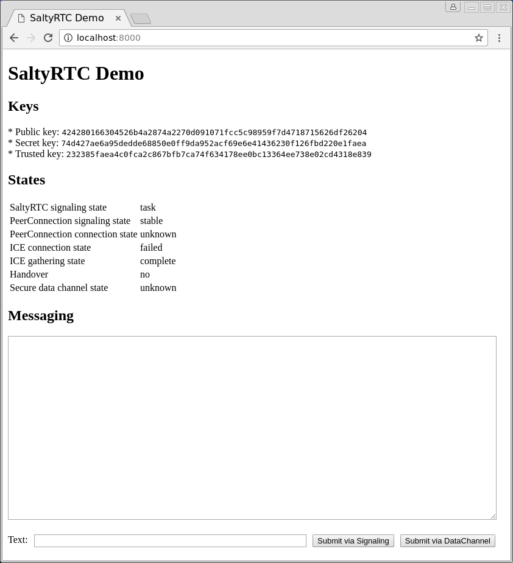
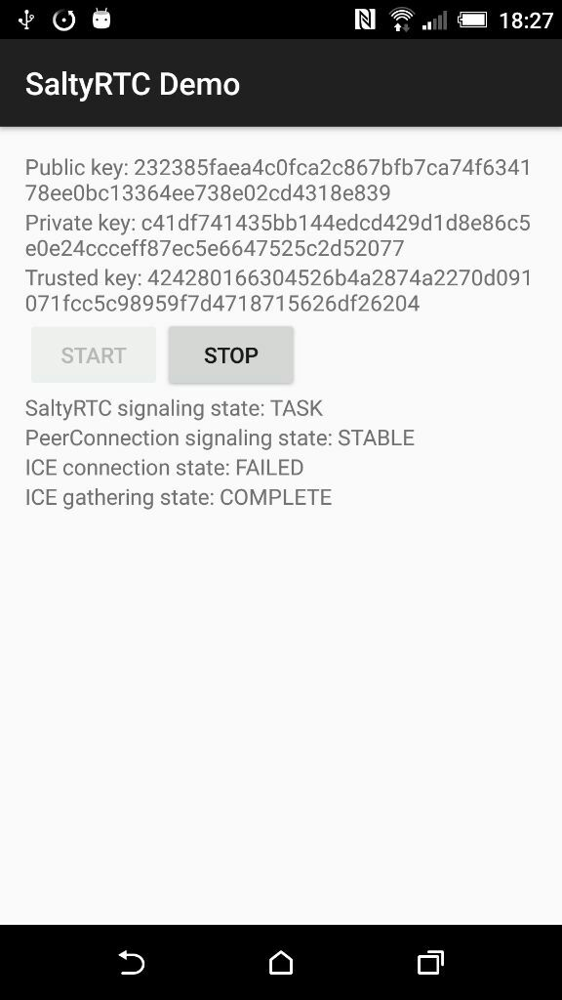

# SaltyRTC Demo

Small demo application with a web interface and an Android app that communicate
over the signaling channel as well as via WebRTC.

&nbsp;&nbsp;&nbsp;&nbsp;&nbsp;&nbsp;&nbsp;&nbsp;

## Usage

### Web

Install dependencies:

    $ npm install

First, adjust the `HOST` and `PORT` variables in the `scripts.js` file and
point them to a [SaltyRTC server][server] instance. Then simply open
`index.html` in a modern web browser with support for WebRTC and ES2015.

### Android

Make sure that the Android SDK is installed and configured properly.

Then, adjust the `HOST` and `PORT` variables in the
`app/src/main/java/org/saltyrtc/demo/app/Config.java` file and point them to a
[SaltyRTC server][server] instance.

Finally, connect an Android 5.0+ device with USB debugging enabled to your
computer and run the following command:

    $ ./gradlew assembleDebug installDebug

## License

    Copyright (c) 2016 Threema GmbH

    Licensed under the Apache License, Version 2.0, <see LICENSE-APACHE file>
    or the MIT license <see LICENSE-MIT file>, at your option. This file may not be
    copied, modified, or distributed except according to those terms.

[server]: https://github.com/saltyrtc/saltyrtc-server-python "SaltyRTC Server"
